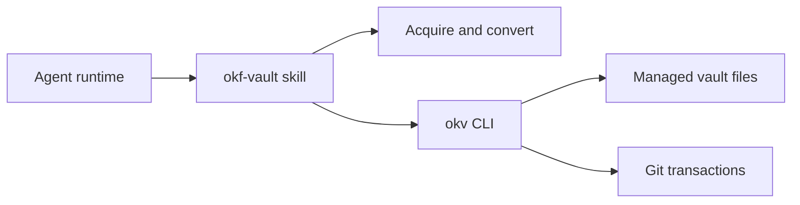

# OKV — Open Knowledge Vault

AI-assisted ingestion for OKF knowledge vaults. A **provider-neutral workflow skill** orchestrates acquisition and conversion; a **deterministic TypeScript CLI** (`okv`) validates notes, manages the manifest, runs graph checks, and performs Git transactions.

See [AGENTS.md](AGENTS.md) for cross-agent onboarding.

## Architecture



| Component      | Location                               | Role                                                      |
| -------------- | -------------------------------------- | --------------------------------------------------------- |
| Workflow skill | `.agents/skills/okf-vault/`            | Orchestration, curator interaction, conversion profiles   |
| Helper CLI     | `src/vault/`, `src/cli.ts`             | Deterministic validation, manifest, graph, dossiers, Git  |
| Contracts      | `.agents/skills/okf-vault/references/` | Note contract, envelopes, vault layout, helper invocation |

The skill decides _what_ to process; the helper decides _whether_ staged output is safe to commit.

Two layers work together:

- **Slash commands** (`/okv-*`) — agent orchestration via the skill and ingest wizard
- **`okv` CLI** — deterministic validation, manifest mutation, graph checks, and Git transactions

## Prerequisites

- **Node.js >= 24** (recommended: see `.nvmrc`)
- **Git**
- **pnpm** (via Corepack; see `packageManager` in `package.json`)

## Quick start

### Install (this repository)

```bash
git clone https://github.com/rafiti052/okf-vault
cd okf-vault
pnpm run setup          # installs CLI + verifies okv works globally + installs Cursor and Claude adapters
```

The setup command completes these steps:

- Builds the `okv` CLI and installs it into pnpm's global bin directory.
- Verifies that `okv --version` works outside the okf-vault repository.
- Installs or validates Cursor and Claude Code adapters and per-command `/okv-*` slash entries.

If setup fails with a PATH error, follow the zsh/bash/fish guidance it prints, restart your shell, and rerun `pnpm run setup`.

**Backwards compatibility:** `pnpm run setup:link` is available as an alias that performs the same install and verification. It is not required for normal end-user setup.

### Create a vault in any repository

After setup succeeds, create a vault in any repository:

```bash
cd ~/my-knowledge-vault
okv init                    # creates ./knowledge/ + Cursor/Claude adapters + curator rule
# or specify a custom vault root:
okv init /path/to/vault
```

For the default setup target, you can use:

```bash
okv init /knowledge-vault
```

`okv init` accepts no arguments (creates `./knowledge/`) or a vault root path. It does not require the installation repository.

| Command                              | Scope                                                                             |
| ------------------------------------ | --------------------------------------------------------------------------------- |
| `okv init` (no args, from repo root) | Vault at `./knowledge/` plus Cursor/Claude adapters and per-command slash entries |
| `okv init <vault-root>`              | Vault only at the given path (scripting, tests, custom layouts)                   |

### Simple flow

Open the repo in Cursor or Claude Code, then type `/okv-ingest` (or any other `/okv-*`). Each command appears individually after the adapters are installed. The ingest wizard accepts one explicit source at a time — including a **YouTube link** when the runtime can retrieve a default transcript with usable timestamps. This is a reduced-scope MVP, not broad YouTube platform support; when no usable transcript is available, the wizard stops with fallback guidance to retry or ingest a local transcript export. CLI fallback:

```bash
node dist/main.js validate ./knowledge
```

## Slash commands

| Goal                         | Command                                                                             |
| ---------------------------- | ----------------------------------------------------------------------------------- |
| Add new content (start here) | `/okv-ingest` — MCP artifact, local file, or YouTube URL (transcript-dependent MVP) |
| New vault at `./knowledge/`  | `/okv-init` or `/okv-bootstrap`                                                     |
| Organize after ingestion     | `/okv-organize`                                                                     |
| Health check                 | `/okv-validate`                                                                     |
| Graph inspection             | `/okv-visualize`                                                                    |
| Ingest + validate pipeline   | `/okv-ingest-check`                                                                 |
| Natural-language query       | `/okv-ask`                                                                          |

Full command list with availability labels and stub links: [commands/registry.md](.agents/skills/okf-vault/commands/registry.md).

## CLI commands

| Command                         | Description                                                                                                                                             |
| ------------------------------- | ------------------------------------------------------------------------------------------------------------------------------------------------------- |
| `init`                          | Create vault layout, manifest, indexes, log, and initial Git commit. No args: `./knowledge/` from repo root plus skill adapters. With path: vault only. |
| `inspect`                       | Check manifest status (`new`, `already_processed`, or `changed_conflict`) for a source                                                                  |
| `validate-staged`               | Validate staged notes against the note contract and envelope anchors                                                                                    |
| `commit`                        | Atomically install a validated source into the vault and update the manifest                                                                            |
| `dossier`                       | Generate dossiers for organize-mode curation                                                                                                            |
| `validate-proposals`            | Validate curation proposal JSON before curator review                                                                                                   |
| `validate-graph`                | Check graph navigation, indexes, and link consistency                                                                                                   |
| `validate`                      | Run the consolidated quality gate (contracts, manifest, graph, recovery state)                                                                          |
| `visualize`                     | Build the configured OKF visualizer HTML output                                                                                                         |
| `recover`                       | Recover from a failed transaction using the journal                                                                                                     |
| `retrieve <vault-root> <query>` | Natural-language query over topic maps — returns ranked results with confidence and coverage-gap signal                                                 |
| `retrieve --eval <vault-root>`  | Run the fixed eval corpus; exits 0 on pass, 3 on threshold miss (hit rate ≥ 0.8)                                                                        |

All commands emit a single JSON object on stdout and human diagnostics on stderr. Exit codes 0–5 map to success, unexpected, usage, validation, conflict, and transaction failures.

## Agent-assisted workflow

### Cursor and Claude Code

Both runtimes are installed and verified by `pnpm run setup`.

| Runtime         | Skill path                              | Slash commands                                         | Notes                                       |
| --------------- | --------------------------------------- | ------------------------------------------------------ | ------------------------------------------- |
| **Cursor**      | `.cursor/skills/okf-vault/` (symlink)   | per-command skill dirs `.cursor/skills/<cmd>/SKILL.md` | Rule: `.cursor/rules/okf-vault.mdc`         |
| **Claude Code** | `.claude/skills/okf-vault/` (symlink)   | `.claude/commands/<cmd>.md`                            | Full skill + references via symlink         |
| **Any agent**   | `.agents/skills/okf-vault/` (canonical) | —                                                      | Single source of truth; adapters point here |

Invoke the **okf-vault** skill for vault tasks:

| Mode         | Purpose                                                        |
| ------------ | -------------------------------------------------------------- |
| `initialize` | Set up a new vault at a curator-chosen path                    |
| `ingest`     | Process an explicit ordered list of sources one at a time      |
| `organize`   | Generate dossiers and curation proposals after ingestion       |
| `validate`   | Run quality checks on an existing vault                        |
| `visualize`  | Open the knowledge graph visualizer after validation passes    |
| `ask`        | Natural-language query grounded in committed notes (read-only) |

The skill enforces explicit sources, sequential processing, visible progress events, and ADR-009 failure-stop behavior. See [SKILL.md](.agents/skills/okf-vault/SKILL.md) for phase order and curator rules.

## Development

```bash
pnpm test              # build + run all tests
pnpm run lint          # ESLint
pnpm run format:check  # Prettier
pnpm run typecheck     # TypeScript without emit
```

### Runtime adapter symlinks

`pnpm run setup` (and no-arg `okf-vault init`) install two kinds of symlinks, all pointing at the canonical skill under `.agents/skills/okf-vault/`:

- **Umbrella skill** — `.cursor/skills/okf-vault/` and `.claude/skills/okf-vault/` → canonical skill (so `/okf-vault` auto-applies and references resolve).
- **Per-command discoverable units** — so every `/okv-*` shows up individually:
  - **Cursor** — `.cursor/skills/<cmd>/SKILL.md` → canonical `commands/<cmd>.md`
  - **Claude Code** — `.claude/commands/<cmd>.md` → canonical `commands/<cmd>.md`

Inside this clone these are relative symlinks; from a foreign `okf-vault init` they fall back to absolute paths into the clone. Canonical command stubs carry `name: <cmd>` (Cursor requires the per-command skill folder name to match) and `disable-model-invocation: true` frontmatter, inherited through the symlinks (ADR-008).

On Windows, if `git config core.symlinks` is `false`, Git may check out symlink paths as plain text files. Enable symlink support (`git config core.symlinks true`) or re-run setup:

```bash
pnpm run setup
```

## Contracts

All durable contracts live in [`.agents/skills/okf-vault/references/`](.agents/skills/okf-vault/references/). Do not maintain duplicate reference files at the repo root.
