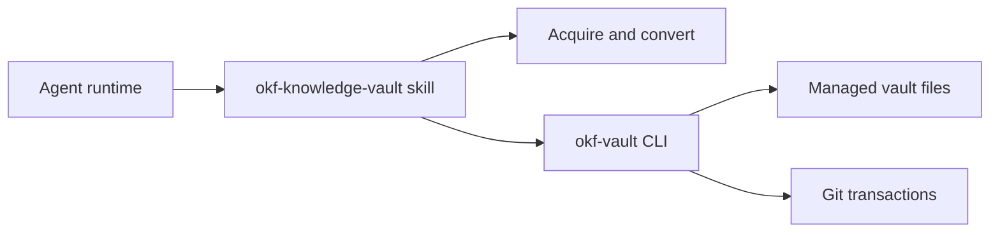

# OKF Knowledge Vault

AI-assisted ingestion for OKF knowledge vaults. A **provider-neutral workflow skill** orchestrates acquisition and conversion; a **deterministic TypeScript CLI** (`okf-vault`) validates notes, manages the manifest, runs graph checks, and performs Git transactions.

See [AGENTS.md](AGENTS.md) for cross-agent onboarding.

## Architecture



| Component | Location | Role |
| --------- | -------- | ---- |
| Workflow skill | `.agents/skills/okf-knowledge-vault/` | Orchestration, curator interaction, conversion profiles |
| Helper CLI | `src/vault/`, `src/cli.ts` | Deterministic validation, manifest, graph, dossiers, Git |
| Contracts | `.agents/skills/okf-knowledge-vault/references/` | Note contract, envelopes, vault layout, helper invocation |

The skill decides *what* to process; the helper decides *whether* staged output is safe to commit.

## Prerequisites

- **Node.js 24** (see `.nvmrc`)
- **Git**
- **pnpm** (via Corepack; see `packageManager` in `package.json`)

## Quick start

```bash
pnpm install
pnpm run build
node dist/main.js init /path/to/vault
node dist/main.js validate /path/to/vault
```

## CLI commands

| Command | Description |
| ------- | ----------- |
| `init` | Create vault layout, manifest, indexes, log, and initial Git commit |
| `inspect` | Check manifest status (`new`, `already_processed`, or `changed_conflict`) for a source |
| `validate-staged` | Validate staged notes against the note contract and envelope anchors |
| `commit` | Atomically install a validated source into the vault and update the manifest |
| `dossier` | Generate dossiers for organize-mode curation |
| `validate-proposals` | Validate curation proposal JSON before curator review |
| `validate-graph` | Check graph navigation, indexes, and link consistency |
| `validate` | Run the consolidated quality gate (contracts, manifest, graph, recovery state) |
| `visualize` | Build the configured OKF visualizer HTML output |
| `recover` | Recover from a failed transaction using the journal |

All commands emit a single JSON object on stdout and human diagnostics on stderr. Exit codes 0–5 map to success, unexpected, usage, validation, conflict, and transaction failures.

## Agent-assisted workflow

Invoke the **okf-knowledge-vault** skill for vault tasks:

- **Cursor** — reads `.agents/skills/okf-knowledge-vault/SKILL.md` via project skills; see `.cursor/rules/okf-vault.mdc`
- **Claude Code** — symlink at `.claude/skills/okf-knowledge-vault`

| Mode | Purpose |
| ---- | ------- |
| `initialize` | Set up a new vault at a curator-chosen path |
| `ingest` | Process an explicit ordered list of sources one at a time |
| `organize` | Generate dossiers and curation proposals after ingestion |
| `validate` | Run quality checks on an existing vault |
| `visualize` | Open the knowledge graph visualizer after validation passes |

The skill enforces explicit sources, sequential processing, visible progress events, and ADR-009 failure-stop behavior. See [SKILL.md](.agents/skills/okf-knowledge-vault/SKILL.md) for phase order and curator rules.

## Development

```bash
pnpm test              # build + run all tests
pnpm run lint          # ESLint
pnpm run format:check  # Prettier
pnpm run typecheck     # TypeScript without emit
```

### Runtime adapter symlinks

Cursor and Claude Code discover `/vault-ingest` via thin symlinks to the canonical command stubs under `.agents/skills/okf-knowledge-vault/commands/`:

- **Cursor** — `.cursor/skills/okf-knowledge-vault/commands/` → canonical `commands/`
- **Claude Code** — `.claude/skills/okf-knowledge-vault/` → canonical skill (includes `commands/`)

On Windows, if `git config core.symlinks` is `false`, Git may check out symlink paths as plain text files. Enable symlink support (`git config core.symlinks true`) or recreate the links manually after clone so runtime adapters resolve to the canonical stubs.

## Contracts

All durable contracts live in [`.agents/skills/okf-knowledge-vault/references/`](.agents/skills/okf-knowledge-vault/references/). Do not maintain duplicate reference files at the repo root.
